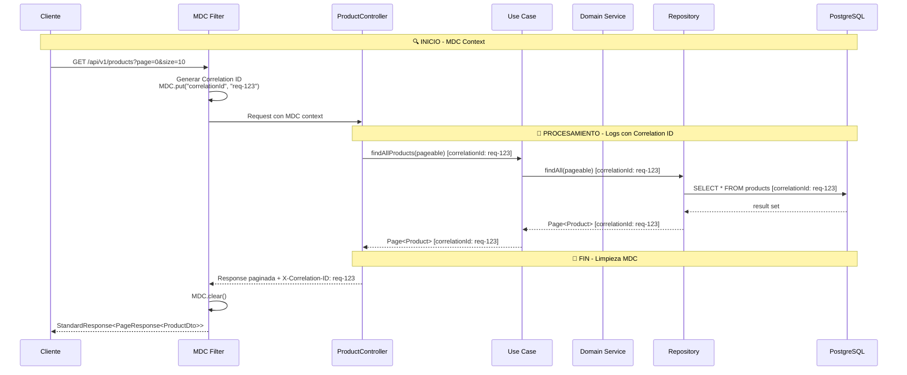

# Product Management Microservice

## Descripción

Microservicio para la gestión de productos desarrollado como parte del desafío técnico de Linktic. Este servicio proporciona operaciones CRUD completas para productos, siguiendo principios de arquitectura hexagonal y Domain-Driven Design.

## 🏗️ Arquitectura

### Estructura de Tres Capas

```
src/main/java/com/linktic/challenge/products/
├── application/          # Capa de Aplicación
│   ├── dto/             # Objetos de Transferencia de Datos
│   ├── usecase/         # Casos de Uso
│   └── mapper/          # Mapeadores Application -> Domain
├── domain/              # Capa de Dominio
│   ├── model/           # Entidades y Value Objects
│   ├── port/            # Puertos (Interfaces)
│   └── exception/       # Excepciones de Dominio
└── infrastructure/      # Capa de Infraestructura
    ├── adapter/         # Adaptadores (Implementaciones)
    ├── persistence/     # Persistencia (JPA, Repositories)
    ├── web/             # Controladores REST
    └── config/          # Configuraciones
```

### Módulo Shared (Librería Interna)

```
shared/
├── constants/           # Constantes globales
├── exception/           # Excepciones compartidas
├── filter/             # Filtros HTTP (MDC, Correlation ID)
├── response/           # Estructuras de respuesta estandarizadas
└── util/               # Utilidades comunes
```

## 🚀 Instalación y Ejecución

### Prerrequisitos

- Java 21
- Docker y Docker Compose
- Gradle 7.6+

### Ejecución con Docker Compose

1. **Clonar el repositorio**
   ```bash
   git clone <repository-url>
   cd products-microservice
   ```

2. **Ejecutar la aplicación**
   ```bash
   docker-compose up -d
   ```

3. **Verificar servicios**
    - **Aplicación**: http://localhost:9091
    - **Documentación API**: http://localhost:9091/swagger-ui.html
    - **PgAdmin**: http://localhost:8080 (admin@products.com/admin)
    - **Base de datos**: PostgreSQL en localhost:5432

### Ejecución Local

1. **Iniciar base de datos**
   ```bash
   docker-compose up postgres -d
   ```

2. **Compilar y ejecutar**
   ```bash
   ./gradlew clean build
   ./gradlew bootRun
   ```

## 🔧 Configuración

### Variables de Entorno

```yaml
# application.yml
server:
  port: 9091

spring:
  datasource:
    url: jdbc:postgresql://localhost:5432/products_db
    username: postgres
    password: postgres
  jpa:
    hibernate:
      ddl-auto: validate
    show-sql: true

logging:
  level:
    com.linktic.challenge: DEBUG
  pattern:
    console: "%d{yyyy-MM-dd HH:mm:ss.SSS} [%X{correlationId:-}] %-5level %logger{36} - %msg%n"
```

## 📊 Cobertura de Pruebas

El proyecto mantiene una cobertura de pruebas del **90%+**, verificada con JaCoCo y SonarQube.

```bash
# Ejecutar pruebas y generar reporte
./gradlew clean test jacocoTestReport

# Ver reporte HTML
open build/reports/jacoco/test/html/index.html
```

## 🎯 Decisiones Técnicas

### 1. Arquitectura Hexagonal (Ports & Adapters)
**Justificación**: Separación clara entre lógica de negocio y detalles de infraestructura, facilitando testing y mantenimiento.

### 2. Domain-Driven Design
**Justificación**:
- Entidades y Value Objects fuertemente tipados
- Excepciones específicas del dominio
- Agregados bien definidos

### 3. **MDC (Mapped Diagnostic Context) y Correlation ID**
**Implementación**:
- Filtro HTTP para gestionar Correlation ID
- Contexto de trazabilidad en logs
- Headers personalizados para tracking

**Configuración MDC**:
```java
// Filtro que gestiona Correlation ID y MDC
public class CorrelationIdFilter implements Filter {
    @Override
    public void doFilter(ServletRequest request, ServletResponse response, 
                        FilterChain chain) {
        String correlationId = generateCorrelationId();
        MDC.put("correlationId", correlationId);
        MDC.put("timestamp", Instant.now().toString());
        
        try {
            chain.doFilter(request, response);
        } finally {
            MDC.clear(); // Limpieza para evitar memory leaks
        }
    }
}
```

**Ventajas del MDC**:
- ✅ **Trazabilidad completa**: Seguimiento de requests a través de microservicios
- ✅ **Debugging simplificado**: Filtrado de logs por correlationId
- ✅ **Monitoreo**: Agrupación de logs por transacción
- ✅ **Performance**: Bajo impacto en el rendimiento

### 4. Jerarquía de Excepciones

```
ProductDomainException (padre)
├── Entity Exceptions
│   ├── ProductNotFoundException (404)
│   ├── ProductAlreadyExistsException (409)
│   └── InvalidProductException (400)
├── Value Object Exceptions
│   ├── InvalidProductIdException
│   ├── InvalidProductNameException
│   └── ...
└── Mapper Exceptions
    └── ProductMapperException (500)
```

**Ventajas**:
- Manejo consistente de errores
- Códigos HTTP apropiados
- Mensajes de error claros para clientes
- **Incluye Correlation ID** en respuestas de error

### 5. Módulo Shared
**Justificación**: Reutilización de código común across microservicios. Temporalmente incluido en el mismo proyecto por restricciones de tiempo.

### 6. Tecnologías Seleccionadas
- **Spring Boot 3.5.6**: Madurez y ecosistema
- **Java 21**: LTS con features modernas
- **PostgreSQL**: Base de datos relacional robusta
- **MapStruct**: Mapeo type-safe y eficiente
- **TestContainers**: Pruebas de integración realistas
- **MDC**: Para logging contextual y trazabilidad

## 🌐 API Endpoints

### Base URL
```
http://localhost:9091/api/v1/products
```

### Endpoints Disponibles

| Método | Endpoint | Descripción | Parámetros |
|--------|----------|-------------|------------|
| **GET** | `/api/v1/products/{id}` | Obtener producto por ID | `id` (path) |
| **GET** | `/api/v1/products` | Listar productos paginados | `page`, `size`, `sortBy`, `sortDirection` |
| **POST** | `/api/v1/products` | Crear nuevo producto | Body: `CreateProductDto` |
| **PUT** | `/api/v1/products/{id}` | Actualizar producto existente | `id` (path), Body: `UpdateProductDto` |
| **DELETE** | `/api/v1/products/{id}` | Eliminar producto | `id` (path) |

### Parámetros de Query para GET /api/v1/products

| Parámetro | Valor por Defecto | Descripción |
|-----------|-------------------|-------------|
| `page` | 0 | Número de página (0-based) |
| `size` | 10 | Tamaño de la página |
| `sortBy` | name | Campo para ordenar |
| `sortDirection` | asc | Dirección: `asc` o `desc` |

### Ejemplos de Uso

```bash
# Obtener producto por ID
curl -X GET "http://localhost:9091/api/v1/products/123" \
  -H "X-Correlation-ID: my-correlation-123"

# Listar productos paginados
curl -X GET "http://localhost:9091/api/v1/products?page=0&size=20&sortBy=price&sortDirection=desc" \
  -H "X-Correlation-ID: my-correlation-123"

# Crear producto
curl -X POST "http://localhost:9091/api/v1/products" \
  -H "Content-Type: application/json" \
  -H "X-Correlation-ID: my-correlation-123" \
  -d '{
    "name": "Laptop Gaming",
    "description": "Laptop para gaming de alta performance",
    "brand": "TechBrand",
    "category": "ELECTRONICS",
    "price": 1299.99,
    "rating": 4.5,
    "imageUrl": "https://example.com/laptop.jpg",
    "specifications": {"ram": "16GB", "storage": "1TB SSD"}
  }'
```

## 🔄 Diagrama de Interacción con MDC



## 🔍 Ejemplo de Logs con MDC

```log
# Request entrante
2024-01-15 10:30:00.123 INFO [req-12345] - Received GET request to /api/v1/products?page=0&size=10

# Procesamiento de negocio
2024-01-15 10:30:00.456 DEBUG [req-12345] - Validating product constraints for page 0

# Acceso a base de datos
2024-01-15 10:30:00.789 DEBUG [req-12345] - Executing paginated query: SELECT * FROM products LIMIT 10 OFFSET 0

# Response exitoso
2024-01-15 10:30:01.123 INFO [req-12345] - Returning 200 OK with 10 products on page 0
```

## 📋 Estructura de Respuesta

### Respuesta Exitosa
```json
{
  "status": "200",
  "message": "Lista de productos obtenida exitosamente",
  "data": {
    "content": [
      {
        "id": "123",
        "name": "Laptop Gaming",
        "description": "Laptop para gaming...",
        "brand": "TechBrand",
        "category": "ELECTRONICS",
        "price": 1299.99,
        "rating": 4.5,
        "imageUrl": "https://example.com/laptop.jpg",
        "specifications": {
          "ram": "16GB",
          "storage": "1TB SSD"
        },
        "createdAt": "2024-01-15T10:30:00Z",
        "updatedAt": "2024-01-15T10:30:00Z"
      }
    ],
    "pageNumber": 0,
    "pageSize": 10,
    "totalElements": 1,
    "totalPages": 1
  },
  "timestamp": "2024-01-15T10:30:01.123Z"
}
```

### Respuesta de Error
```json
{
  "status": "404",
  "message": "No se pudo encontrar el producto solicitado",
  "errors": [
    {
      "code": "PRODUCT_NOT_FOUND",
      "title": "Producto no encontrado",
      "detail": "No se encontró ningún producto con ID: 999"
    }
  ],
  "timestamp": "2024-01-15T10:30:01.123Z",
  "correlationId": "req-12345"
}
```

## 🧪 Testing

```bash
# Ejecutar todas las pruebas
./gradlew test

# Ejecutar con cobertura
./gradlew jacocoTestReport

# Ejecutar pruebas de integración
./gradlew integrationTest

# Verificar calidad de código con Sonar
./gradlew sonar
```

### Testing con MDC

```java
@Test
void shouldMaintainMDCContextInOperations() {
    // Given
    String correlationId = "test-correlation-123";
    MDC.put("correlationId", correlationId);
    
    // When & Then
    assertThat(MDC.get("correlationId")).isEqualTo(correlationId);
}
```

## 📦 Build

```bash
# Build completo con pruebas
./gradlew clean build

# Build sin pruebas
./gradlew clean build -x test

# Generar reporte Sonar
./gradlew sonar

# Análisis de dependencias
./gradlew dependencyUpdates
```

## 🛠️ Desarrollo

### Estructura de Commits
- `feat`: Nueva funcionalidad
- `fix`: Corrección de bugs
- `docs`: Documentación
- `test`: Pruebas
- `refactor`: Refactorización
- `chore`: Tareas de mantenimiento

### Code Style
El proyecto sigue Google Java Style Guide con adaptaciones para Spring Boot y prácticas modernas de observabilidad.

## 📊 Monitoreo y Observabilidad

### Métricas Clave
- **Trazabilidad**: 100% de requests con Correlation ID
- **Logs estructurados**: Con MDC para filtering
- **Tiempo de respuesta**: Por endpoint y correlationId
- **Rate de errores**: Por tipo de excepción y correlationId

### Headers de Trazabilidad

- **X-Correlation-ID**: Identificador único de transacción (generado automáticamente si no se provee)
- **X-User-ID**: Identificador de usuario (opcional)

## 📄 Licencia

Este proyecto es desarrollado como parte del desafío técnico de Linktic.